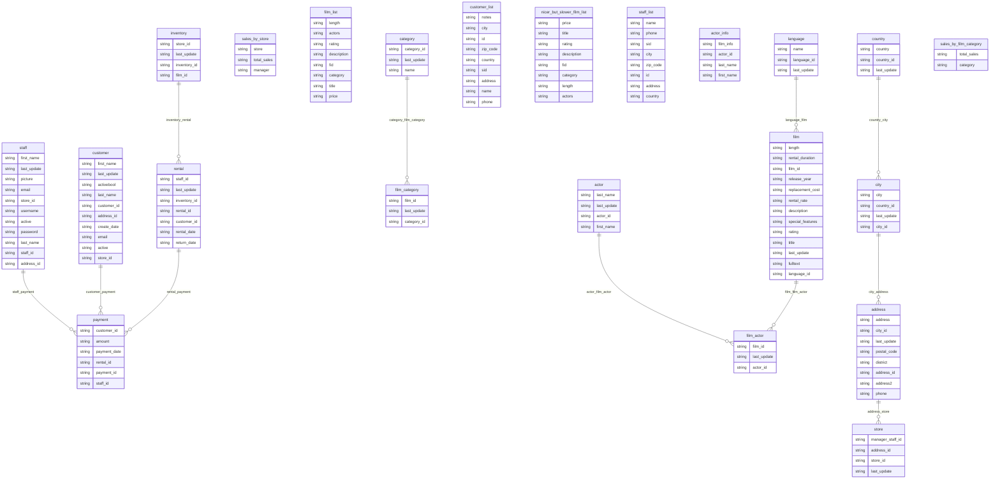

```mermaid
erDiagram
   staff ||--o{ payment : staff_payment
   staff {
       string first_name
       string last_update
       string picture
       string email
       string store_id
       string username
       string active
       string password
       string last_name
       string staff_id
       string address_id
   }
   inventory ||--o{ rental : inventory_rental
   inventory {
       string store_id
       string last_update
       string inventory_id
       string film_id
   }
   customer ||--o{ payment : customer_payment
   customer {
       string first_name
       string last_update
       string activebool
       string last_name
       string customer_id
       string address_id
       string create_date
       string email
       string active
       string store_id
   }
   sales_by_store {
       string store
       string total_sales
       string manager
   }
   film_category {
       string film_id
       string last_update
       string category_id
   }
   rental ||--o{ payment : rental_payment
   rental {
       string staff_id
       string last_update
       string inventory_id
       string rental_id
       string customer_id
       string rental_date
       string return_date
   }
   actor ||--o{ film_actor : actor_film_actor
   actor {
       string last_name
       string last_update
       string actor_id
       string first_name
   }
   film_list {
       string length
       string actors
       string rating
       string description
       string fid
       string category
       string title
       string price
   }
   city ||--o{ address : city_address
   city {
       string city
       string country_id
       string last_update
       string city_id
   }
   category ||--o{ film_category : category_film_category
   category {
       string category_id
       string last_update
       string name
   }
   film ||--o{ film_actor : film_film_actor
   film {
       string length
       string rental_duration
       string film_id
       string release_year
       string replacement_cost
       string rental_rate
       string description
       string special_features
       string rating
       string title
       string last_update
       string fulltext
       string language_id
   }
   customer_list {
       string notes
       string city
       string id
       string zip_code
       string country
       string sid
       string address
       string name
       string phone
   }
   film_actor {
       string film_id
       string last_update
       string actor_id
   }
   nicer_but_slower_film_list {
       string price
       string title
       string rating
       string description
       string fid
       string category
       string length
       string actors
   }
   address ||--o{ store : address_store
   address {
       string address
       string city_id
       string last_update
       string postal_code
       string district
       string address_id
       string address2
       string phone
   }
   payment {
       string customer_id
       string amount
       string payment_date
       string rental_id
       string payment_id
       string staff_id
   }
   staff_list {
       string name
       string phone
       string sid
       string city
       string zip_code
       string id
       string address
       string country
   }
   store {
       string manager_staff_id
       string address_id
       string store_id
       string last_update
   }
   actor_info {
       string film_info
       string actor_id
       string last_name
       string first_name
   }
   country ||--o{ city : country_city
   country {
       string country
       string country_id
       string last_update
   }
   language ||--o{ film : language_film
   language {
       string name
       string language_id
       string last_update
   }
   sales_by_film_category {
       string total_sales
       string category
   }

```